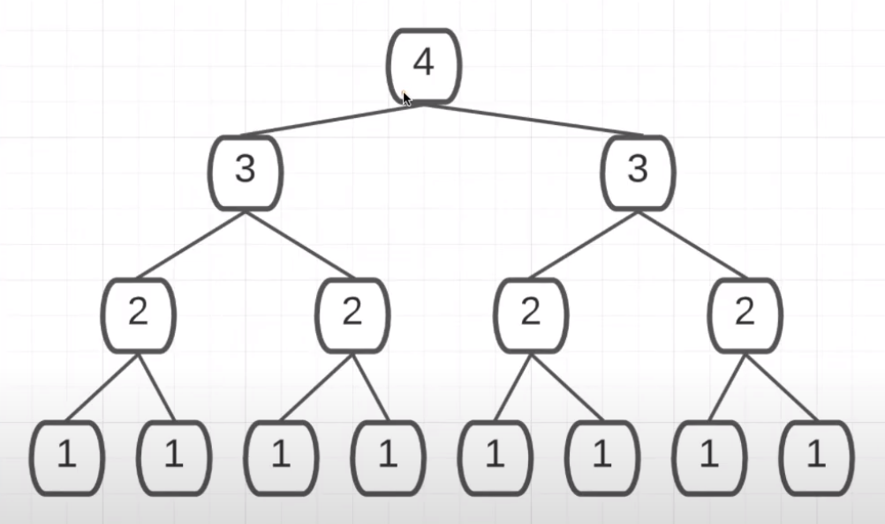
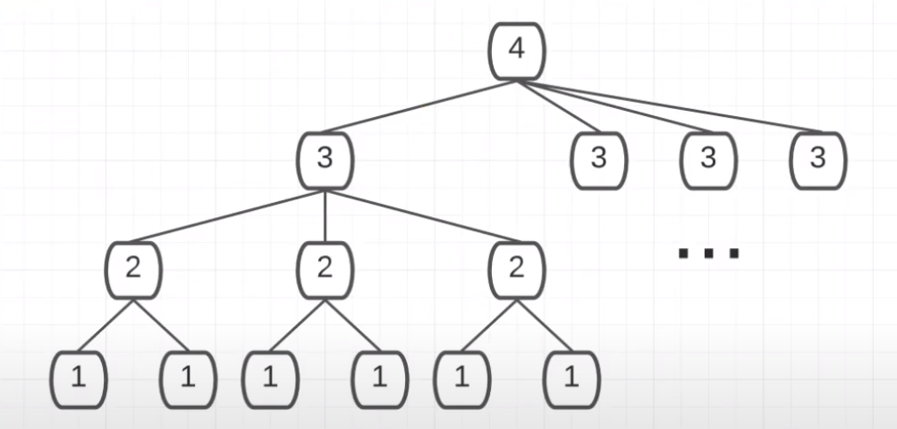

Part 1  https://www.youtube.com/watch?v=HfIH3czXc-8&list=PLxQ8cCJ6LyOZHhAjIYrEFWcfYdyJl5VYf&index=3
Part 2  https://www.youtube.com/watch?v=zo7YFqw5hNw&list=PLxQ8cCJ6LyOZHhAjIYrEFWcfYdyJl5VYf&index=2
Graph image with complexities https://www.bigocheatsheet.com/

* When calculating space complexity for recursion, remember recursive calls (call stack calls) take
up space.


* Constant: O(1)
* Linear: O(n)  
    * 1, 2, 3, ...n
* Logarithmic: O(log n) 
    * using Log base 2 (log2(n) or 2^n) 1=1,...,4=2,...8=3,...16=4,...n
* Loglinear/ Linearithmic: O(n*log(n))
* Polynomial: O(n^c) n=input, c=constant (n^2, n^3, ect.)
    n^2 example
    ```
    for el in arr:
        for el in arr:
            foo(el)
    ```
* Exponential: O(c^n) n=input, c=constant (2^m, 3^n, ect.)
    2^n example
    ```
    def foo(n):
        if n == 1: return
        foo(n - 1)
        foo(n - 1)
    ```
    * these are viewed best as trees. example where n = 3 for foo(n)
    * 
* Factorial: O(n!) 4! = 4 * 3 * 2 * 1 / n! = n(n - 1)...2 * 1
    3! example
    def foo(n):
        if n == 1: return
        for i in n:
            foo(n - 1)
    * these  are viewed best as trees.  example where n = 3 for foo(n)
    * 

        